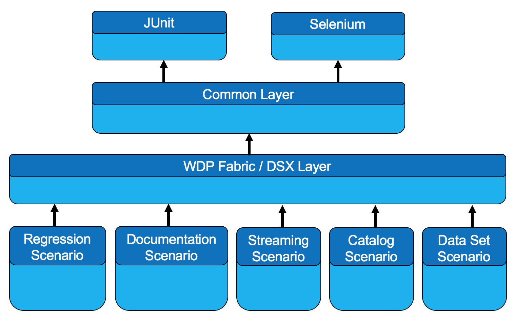

# iTestCloud
The iTestCloud is a framework providing building blocks for developing robust automated UI tests for any web application with ease. It is based on the open source Selenium and JUnit projects. This framework is compatible with all major web technologies such as React and browsers such as FireFox, Chrome, Internet Explorer, Safari ...etc. It can be utilized on all major platforms such as Windows, Linux, Unix, OS X, Android, Mac OS X, ...etc. The test scenarios developed with this framework can be executed in a number of ways such as Jenkins, Travis, Eclipse, command-line, ...etc.  This framework contains approximately 30K lines of code and growing. Over 1700 fully automated tests have been developed for validating a wide range of contexts and features of the Cloud Pak for Data (CPD) project. The framework code is thoroughly documented with inline and JavaDoc comments. 

## Architecture
The following is the architectural diagram of the iTestCloud framework.

## Source Code and Project Locations
1. The iTestCloud framework is developed and distributed via the the [iTestCloud repository](https://github.com/IBM/iTestCloud). 
2. The [iTestCloud Repository](https://github.com/IBM/iTestCloud) is relied on to track the development, defects as well as enhancements requests.

## Educational Materials
1. [iTestCloud Slide Presentation](artifacts/iTestCloud.pptx)
2. [iTestCloud README](https://github.com/IBM/iTestCloud/blob/master/README.md)
3. [Coding Standards](docs/coding_style.md)
4. [Javadoc Standards](docs/javadoc_standards.md)

## Configuration and Setup
Please complete the following steps to setup and configure your system for developing automated UI tests using the iTestCloud framework.

1. [Eclipse Setup](docs/eclipse_setup.md)
2. [Browser Setup](docs/browser_setup.md)
3. [Jenkins Slave\Agent Setup](docs/jenkins_slave_setup.md) (optional)

## Test Scenario Development
The following document describes how to develop a new test scenario with the iTestCloud framework: [Test Scenario Development](docs/scenario_development.md)

## Test Scenario Execution
A personal account can be used when executing tests against the CPDaaS.

1. [Using a personal account for test execution](docs/test_run_setup.md)

A test scenario developed with the iTestCloud Framework can be executed in a number of ways. The following are some of them.

1. [From Eclipse](docs/eclipse_execution.md)
2. [From Command Line](docs/cmdln_execution.md)
3. [From Jenkins](docs/jenkins_execution.md)
