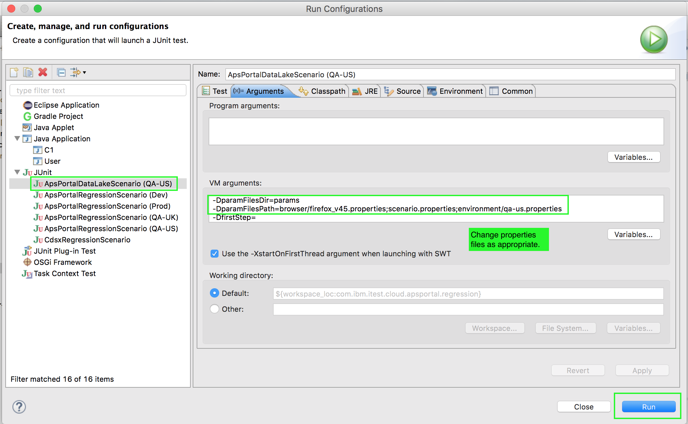

#Test Scenario Execution via Eclipse

Once a test scenario has been developed, you're ready to execute the particular test scenario. You may do so in Eclipse by launching the scenario via an appropriate launch configuration as shown below.

Users for running the tests are defined in scenario.properties. To avoid conflicts if tests are run by two or more users at the same time, you may want to change the TestUser (the Admin user) to yourself. Use http://base64encode.net/ to encode your password. For the Catalog scenario.properties, be sure also to set properties organization and space to your personal values.
