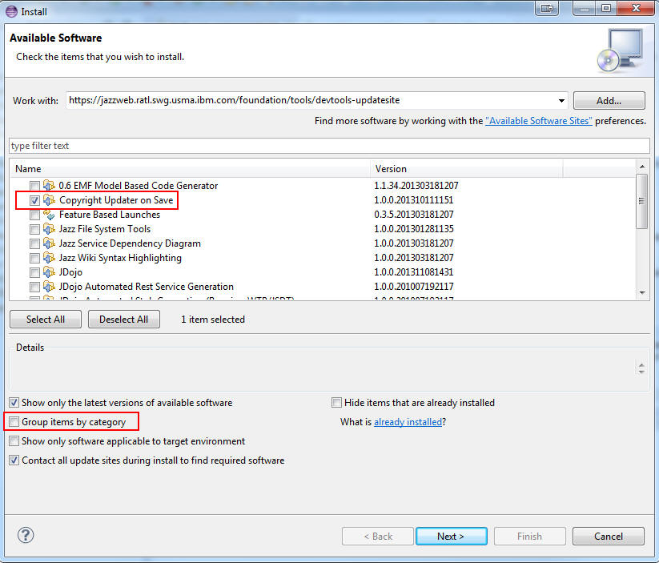
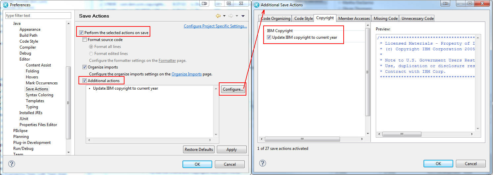

# Eclipse Setup
Please complete the following steps to setup and configure Eclipse for developing automated UI tests using the iTestCloud framework. 

1. Download and install the latest Java SDK or JRE 1.8 from the [IBM Java Information Manager](http://w3.hursley.ibm.com/java/jim/jim/index.html). You may also install it via the **Mac@IBM App Store** if you are using a Mac. 
2. Download and install the latest Java SDK or JRE 15 from the [IBM Java Information Manager](http://w3.hursley.ibm.com/java/jim/jim/index.html). For example [Oracle Mac OS Latest - 15.0.1](http://w3.hursley.ibm.com/java/jim/oraclejdks/latest/oraclemacoslatest/1501/index.html), [Oracle Windows x64 Latest - 15.0.1](http://w3.hursley.ibm.com/java/jim/oraclejdks/latest/oraclewindowsx64latest/1501/index.html), [Oracle Linux x64 Latest - 15.0.1](http://w3.hursley.ibm.com/java/jim/oraclejdks/latest/oraclelinuxx64latest/1501/index.html), ...etc.
3. Download and install [Eclipse 2020-12 R IDE for Eclipse Committers](https://www.eclipse.org/downloads/packages/release/2020-12/r/eclipse-ide-eclipse-committers)
4. Start Eclipse into a new dedicated workspace for iTestCloud related work. Make sure to use the Java SDK or JRE 15 for Eclipse. This version of Eclipse requires a Java SDK or JRE 11 at minimum.
5. Open the [iTestCloud preferences](../artifacts/preferences.epf) link, click on the `Raw` button, and save the file into a directory in the local file system by selecting `File -> Save As...` from the menu of the browser.
6. Import the downloaded preferences file into Eclipse by selecting "File -> Import... -> General -> Preferences". Make sure to import all preferences from the file. 
7. Install the **Copyright Updater on Save** by completing the following steps. Download its [update site](../artifacts/copyrightsaveaction.zip) ZIP file, extract it into a directory in the local file system, select `Help -> Install New Software...` from Eclipse menu, click the `Add` button from the `Install` dialog, click the `Local` button in the `Add Repository` dialog, select the local directory where the update site ZIP file was extracted to, enter `Copyright Updater` as the `Name` in the `Add Repository` dialog, and click the `Add` button. Make sure to uncheck/clear the **Group items by category** box in the Install dialog when selecting the Copyright Updater on Save to be installed. Proceed with the installation by accepting the license terms and clicking on the `Next` followed by the `Install` buttons 
    
8. Open the **Save Actions Tab** of the **Preferences Dialog**
9. Select the **Perform the selected actions on save** and **Additional actions** check-boxes, click on the Configure... button, select the **Update IBM copyright to current year** in the **Copyright tab** and click the OK button.
   
Once configured, the Copyright Updater on Save is enabled in your Eclipse client. As a result, when a change is made and saved in a *.java file, the year in the copyright notice (at the top of the file)  will automatically be updated to the current year, if it is the first update in the current year. If the file is missing the IBM copyright notice, the tool will add the IBM standard copyright notice at the top of the file.
10. Open the **Installed JREs Tab** of the **Preferences Dialog**. The Java SDK or JRE 15 should have already been recognized as an installed JRE in this tab. Add the Java SDK or JRE 1.8 as an installed JRE to this tab as well. 
   
11. Only select/check the Java SDK or JRE 1.8 in the **Installed JREs Tab**. This Java SDK or JRE 1.8 will then be used by Eclipse to run any Java based projects in it such as the iTestCloud automated UI tests.

12. Open the **Compiler Tab** of the **Preferences Dialog** and select **1.8** as the **Compiler compliance level**.
   
13. Save all the changes and close the **Preferences Dialog**.