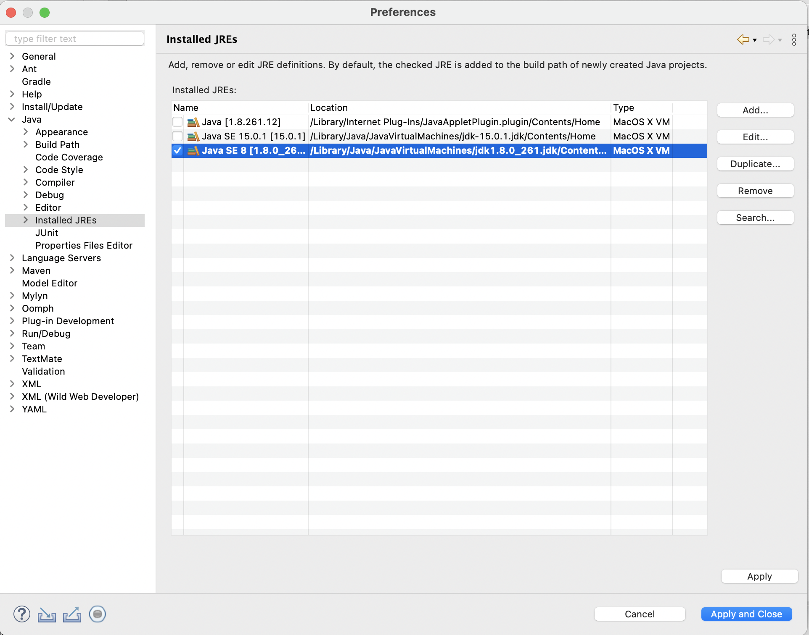

# Eclipse Setup
Please complete the following steps to setup and configure Eclipse for developing automated UI tests using the iTestCloud framework. 

1. Download and install the latest Java SDK or JRE 21 from the [IBM Java Information Manager](http://w3.hursley.ibm.com/java/jim/jim/index.html). You may also install it via the **Mac@IBM App Store** if you are using a Mac. 
3. Download and install [Eclipse 2025-03 R IDE for Eclipse Committers](https://www.eclipse.org/downloads/packages/release/2025-03/r/eclipse-ide-eclipse-committers)
4. Start Eclipse into a new dedicated workspace for iTestCloud related work.
5. Open the [iTestCloud preferences](../artifacts/preferences.epf) link, click on the `Raw` button, and save the file into a directory in the local file system by selecting `File -> Save As...` from the menu of the browser.
6. Import the downloaded preferences file into Eclipse by selecting "File -> Import... -> General -> Preferences". Make sure to import all preferences from the file.
9. Open the **Installed JREs Tab** of the **Preferences Dialog**. The Java SDK or JRE 21 should have already been recognized as an installed JRE in this tab.
   
11. Open the **Compiler Tab** of the **Preferences Dialog** and select **21** as the **Compiler compliance level**.
   
12. Save all the changes and close the **Preferences Dialog**.